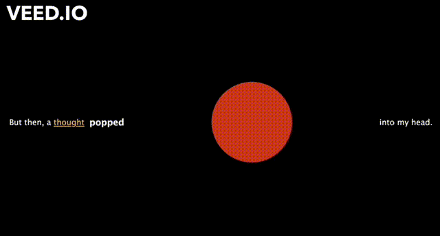

# I'm lovin' it

[I'm lovin' it](http://laylayun.github.io/iml300/project-1/index) is an interactive web experience blabla (One sentence summary).

### Description

This project started with a simple question: “Where does this food come from?” As I was biting into my McDonald’s Crispy Chicken Sandwich, I realized that I knew nothing about what was going into my own body.

This website can be broken down into two parts. First, it mimics the regular dining experience at McDonald’s: ordering food, sitting down, and biting into your chicken nuggets. Then, it transitions into a research-based inquiry of where the chicken nuggets come from. This section visualizes the confusing research process through the sectional breaks, toggle lists, and animations.

The sudden change in tone between these two parts adds to the element of surprise. I wanted to reflect on the shock I experienced as I was researching what was inside the chicken nuggets. Furthermore, I utilized fewer animations in the first section to communicate the mundane, regular experience of going to McDonald’s. Then, in the second section, I utilized more sectional breaks, lists, animations, and tables to efficiently communicate the difficulty in finding the true source of your food.
